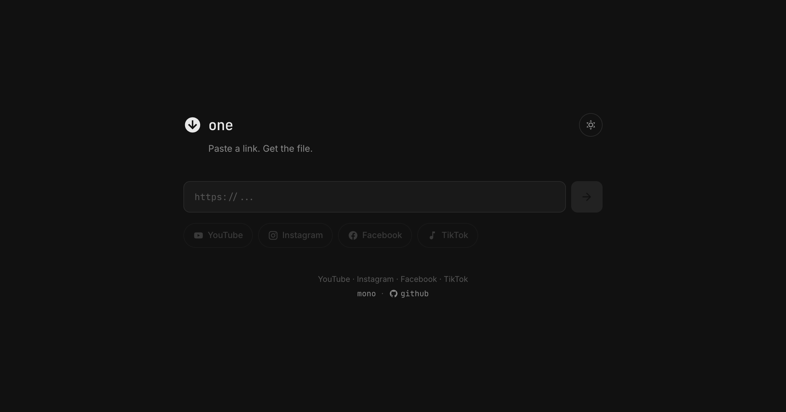

# one

Video downloader frontend with an anti-scraping layer. Download videos from YouTube, Instagram, TikTok, and Facebook — API responses are encrypted with AES-256-GCM on the server and can only be decrypted by a Rust-compiled WASM binary on the client side.



## Concept

A common problem with video downloader websites is that bots/scrapers can directly hit the API endpoints and grab download links without going through the frontend. **one** addresses this by:

1. **Server** receives requests from the client, fetches data from the upstream API ([Mono](https://mono.fdvky.me)), then **encrypts the entire response** using AES-256-GCM before sending it to the browser.
2. **Client** receives the ciphertext and decrypts it using a **Rust-compiled WebAssembly** binary that has the key embedded inside it.
3. **Every build**, a new random key is generated, then:
   - stored as plaintext in `server/utils/secret.ts` (for server-side encryption)
   - XOR-obfuscated and baked into the WASM binary via `build.rs` (for client-side decryption)

The result: scrapers intercepting API responses will only get useless ciphertext. To decrypt it, they'd need to reverse-engineer a WASM binary whose key changes on every deploy.

```
┌──────────┐     POST /api/proxy      ┌──────────┐      GET /{platform}   ┌──────────┐
│  Browser │ ──────────────────────▸  │  Nuxt    │ ──────────────────▸  │  Mono    │
│          │                          │  Server  │ ◂──────────────────  │  API     │
│          │  ◂── { t, d, a }  ──── │          │    (plaintext JSON)  │          │
│          │     (encrypted)          │          │                      └──────────┘
│          │                          └──────────┘
│          │
│  WASM    │── decrypt(d, t, a) ──▸ plaintext JSON ──▸ render UI
└──────────┘
```

## Tech Stack

| Layer | Technology |
|-------|------------|
| Framework | [Nuxt 4](https://nuxt.com) (Vue 3, Nitro, Vite) |
| Styling | [Tailwind CSS v4](https://tailwindcss.com) via `@tailwindcss/vite` |
| Server Encryption | Node.js `crypto` — AES-256-GCM |
| Client Decryption | Rust → WebAssembly via [`wasm-pack`](https://rustwasm.github.io/wasm-pack/) |
| Key Obfuscation | Rust `build.rs` — XOR obfuscation at compile time |
| Upstream API | [Mono API](https://mono.fdvky.me) |
| Deployment | Vercel (via GitHub Actions) |

## Project Structure

```
one/
├── app/
│   ├── app.vue                  # Single-page app (input, platform selector, results)
│   ├── assets/css/main.css      # Tailwind v4 config, theme variables (dark/light)
│   └── utils/wasmConfig.ts      # [auto-generated] WASM file paths
├── server/
│   ├── api/
│   │   ├── proxy.post.ts        # Proxies to Mono API + encrypts response with AES
│   │   └── yt-download.get.ts   # Proxy redirect for YouTube downloads
│   └── utils/
│       └── secret.ts            # [auto-generated] AES key (plaintext hex)
├── wasm-decrypt/
│   ├── Cargo.toml               # Rust dependencies (aes-gcm, hex, zeroize)
│   ├── build.rs                 # Compile-time key obfuscation via XOR
│   └── src/lib.rs               # decrypt() function exported to JS
├── public/
│   └── wasm/                    # [auto-generated] WASM binary + JS wrapper
├── build.sh                     # Build pipeline: keygen → WASM → Nuxt
├── nuxt.config.ts
└── .github/workflows/deploy.yml # CI/CD: Rust + wasm-pack + Nuxt → Vercel
```

Files marked `[auto-generated]` are created by `build.sh` and **must not be committed** (already in `.gitignore`).

## Setup

### Prerequisites

- [Node.js](https://nodejs.org) ≥ 20
- [pnpm](https://pnpm.io)
- [Rust](https://rustup.rs) (stable)
- [wasm-pack](https://rustwasm.github.io/wasm-pack/installer/)

```bash
# Install Rust + wasm target
curl --proto '=https' --tlsv1.2 -sSf https://sh.rustup.rs | sh
rustup target add wasm32-unknown-unknown

# Install wasm-pack
curl https://rustwasm.github.io/wasm-pack/installer/init.sh -sSf | sh
```

### Development

```bash
# 1. Clone the repo
git clone https://github.com/fdvky1/one.git
cd one

# 2. Install dependencies
pnpm install

# 3. Set up environment variables
cp .env.example .env
# Edit .env and fill in API_KEY

# 4. Start the dev server
pnpm dev
```

> **Note:** In development mode (`NODE_ENV=development`), the server returns plaintext responses (`{ raw: data }`) without encryption. WASM is not needed for development.

### Production Build

```bash
# One command does everything:
# 1. Generate a new AES-256 key
# 2. Inject key into server/utils/secret.ts
# 3. Compile Rust WASM with obfuscated key
# 4. Build the Nuxt app

bash build.sh
```

Production output is in `.output/` (or `.vercel/output/` if `NITRO_PRESET=vercel`).

### Environment Variables

| Variable | Description |
|----------|-------------|
| `API_KEY` | API key for authenticating with the Mono API |
| `BASE_URL` | Mono API base URL (default: `https://mono.fdvky.me/api/v1`) |

## Deployment

Automatically deployed to Vercel via GitHub Actions on every push to `main`. The workflow:

1. Sets up Rust toolchain + wasm-pack
2. Pulls environment variables from Vercel
3. Runs `build.sh` (keygen → WASM → Nuxt)
4. Deploys prebuilt output to Vercel

Required GitHub repository secrets:

| Secret | Description |
|--------|-------------|
| `VERCEL_TOKEN` | Vercel deploy token |
| `VERCEL_ORG_ID` | Vercel organization ID |
| `VERCEL_PROJECT_ID` | Vercel project ID |

## Encryption Flow

```
BUILD TIME:
  openssl rand → RAW_KEY (32 bytes hex)
       │
       ├──▸ server/utils/secret.ts    (plaintext, for Node.js crypto)
       │
       └──▸ BUILD_TIME_KEY env var
              │
              ▼
         build.rs (Rust)
              │  XOR with random pad
              ▼
         XORED_KEY + XOR_PAD (embedded in WASM binary)

RUNTIME:
  Browser POST /api/proxy → Server fetches upstream → AES-256-GCM encrypt
                                                            │
       ┌────────────────────────────────────────────────────┘
       │   { t: iv, d: ciphertext, a: authTag }
       ▼
  Browser loads WASM → XOR_PAD ⊕ XORED_KEY → original key
                                 → AES-256-GCM decrypt → plaintext JSON
```

